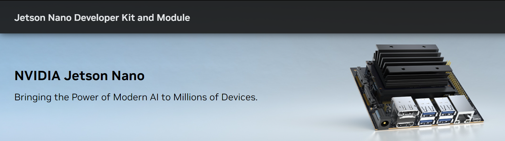
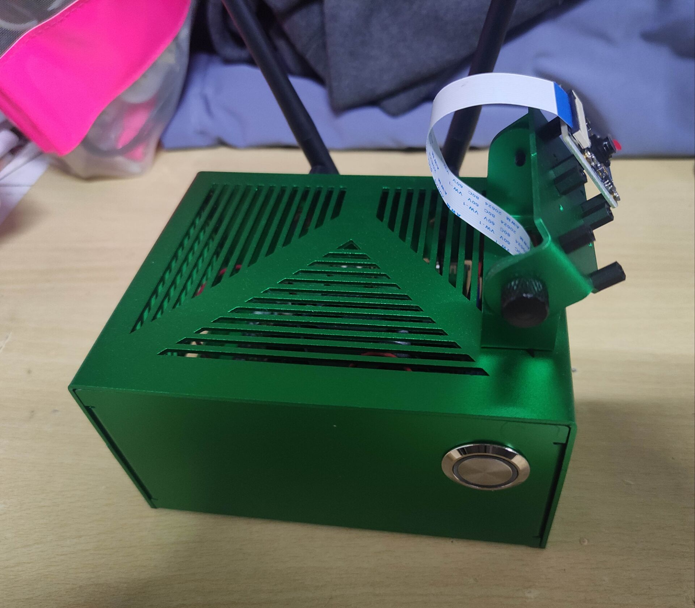
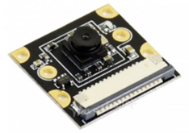
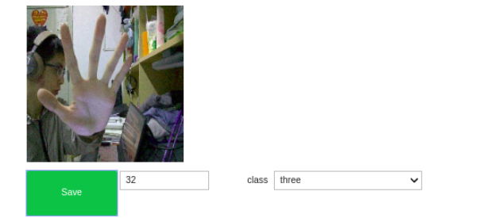
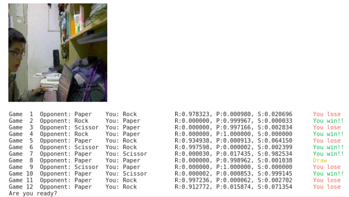

# Scissors-Stone-Cloth-finger-guessing-based-on-Jetson-Nano
Neural Network and Deep Learning coursework 

The whole project was deployed in **Jetson Nano** 

The camera used to collect data is Sony IMX219. 

This project integrates data collection, model training and testing. 
In order to avoid overstaffing of the project size, I only provide the directory format of the dataset. You can collect the dataset by yourself. 

